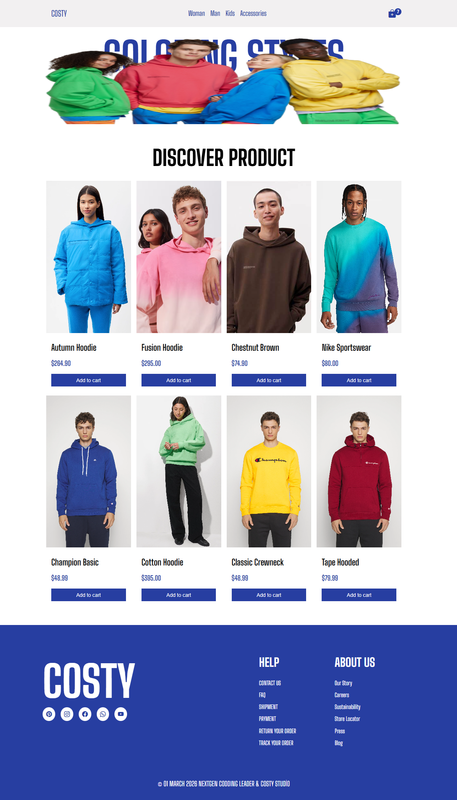

<h1 align="center">🛒 Modular E-Commerce App</h1>

HTML, SCSS ve Vanilla JavaScript (ES6 Modules) kullanılarak geliştirilmiş,
modüler mimariye sahip, dinamik ürün listeleme ve sepet yönetimi özellikleri içeren
modern ve tamamen responsive <strong>E-Commerce Application</strong> çalışmasıdır.

<h2>📌 Proje Amacı</h2>

Bu proje, Vanilla JavaScript kullanarak framework olmadan bir e-ticaret
uygulamasının temel mimarisini kurmak amacıyla geliştirilmiştir.
State yönetimi, sepet mantığı ve localStorage veri kalıcılığı
üzerine pratik yapılmıştır.

<ul>
<li>Dinamik ürün listeleme (JSON veri yapısı)</li>
<li>Sepete ürün ekleme / çıkarma</li>
<li>Adet güncelleme sistemi</li>
<li>Toplam fiyat hesaplama</li>
<li>Shipping (kargo) koşullu fiyatlandırma</li>
<li>LocalStorage ile veri kalıcılığı</li>
<li>Modüler JavaScript mimarisi</li>
</ul>

<h2>🛠 Kullanılan Teknolojiler</h2>

<ul>
<li>HTML5 (Semantic yapı)</li>
<li>SCSS (Modüler stil organizasyonu)</li>
<li>Vanilla JavaScript (ES6 Modules)</li>
<li>LocalStorage API</li>
<li>JSON veri yapısı</li>
<li>Responsive Design</li>
<li>Font Awesome</li>
<li>Google Fonts</li>
</ul>

<h2>✨ Öne Çıkan Özellikler</h2>

<ul>
<li>Dinamik ürün kartları oluşturma</li>
<li>Sepet sistemi (Add / Remove / Update Quantity)</li>
<li>Otomatik toplam fiyat hesaplama</li>
<li>500₺ altı siparişlerde kargo ücreti ekleme</li>
<li>LocalStorage ile sepeti kaybetmeden saklama</li>
<li>Responsive e-commerce arayüzü</li>
<li>Temiz ve modüler kod organizasyonu</li>
<li>Kullanıcı dostu modern UI tasarımı</li>
</ul>

<h2>📂 Proje Yapısı</h2>

<pre>
modular-ecommerce-app/
│
├── index.html
├── style.css
├── db.json
├── js/
│   ├── main.js
│   ├── ui.js
│   ├── cart.js
│   ├── helpers.js
│   └── api.js
├── image.png
└── image.gif
</pre>

<h2>📸 Proje Önizleme</h2>

<h2>🎥 Demo (GIF)</h2>

<h2>🚀 Kurulum</h2>

Projeyi klonlayın:

<pre>
git clone https://github.com/kenansonmez1617-hub/modular-ecommerce-app.git
</pre>

Ardından <strong>index.html</strong> dosyasını tarayıcıda açmanız yeterlidir.

<h2>👨‍💻 Geliştirici</h2>

<strong>Kenan Sönmez</strong> 
Frontend Developer

GitHub: 
<a href="https://github.com/kenansonmez1617-hub" target="_blank">
https://github.com/kenansonmez1617-hub
</a>

LinkedIn: 
<a href="https://www.linkedin.com/in/kenan-sonmez" target="_blank">
https://www.linkedin.com/in/kenan-sonmez
</a>

<h2>📄 Lisans</h2>

Bu proje eğitim ve portfolyo amaçlı geliştirilmiştir.
İncelenebilir ve geliştirilebilir.

⭐ Projeyi beğendiyseniz GitHub üzerinden yıldız bırakabilirsiniz.

